# NIFTY 50 — Intraday Movement & Gap Analysis

Analysis of NIFTY 50 intraday price movement, overnight gaps, and their correlation with India VIX.

**Data**: ~4,500 trading days from 2007-09-17 to 2026-03-13 (source: Yahoo Finance)

> For setup instructions, metric definitions, and script details see [docs/](docs/).

## Table of Contents

- [Correlation Results](#correlation-results)
  - [1. Static Correlations (Pearson, Spearman, Kendall)](#1-static-correlations-pearson-spearman-kendall)
  - [2. Rolling Correlations](#2-rolling-correlations-60-day--252-day-windows)
  - [3. Lagged Cross-Correlations](#3-lagged-cross-correlations---20-days)
  - [4. Mutual Information](#4-mutual-information-non-linear-dependencies)
  - [5. Regime-Based Analysis](#5-regime-based-analysis-vix-regimes)
  - [6. Scatter Plots with Linear Regression](#6-scatter-plots-with-linear-regression)
- [Correlation Summary](#correlation-summary)
- [Breakout Continuation Analysis](#breakout-continuation-analysis)
  - [Frequency](#frequency)
  - [Continuation Streaks](#continuation-streaks)
  - [Forward Returns After Breakouts](#forward-returns-after-breakouts)
  - [Continuation Return by Streak Length](#continuation-return-by-streak-length)
  - [Breakout Velocity and Magnitude](#breakout-velocity-and-magnitude)
  - [Does Breakout Size Predict Continuation?](#does-breakout-size-predict-continuation)
  - [Recovery After Bearish Breakdowns](#recovery-after-bearish-breakdowns)
  - [VIX and Breakout Dynamics](#vix-and-breakout-dynamics)
- [Continuation Summary](#continuation-summary)
- [Breakout Strategy Backtest](#breakout-strategy-backtest)
  - [Strategy Design](#strategy-design)
  - [Baseline Results](#baseline-results)
  - [Optuna-Optimized Parameters](#optuna-optimized-parameters)
  - [Optimized Results](#optimized-results)
  - [Equity Curves](#equity-curves)
  - [Backtest Takeaways](#backtest-takeaways)
- [5-Minute Data Backtest: EOD vs Intraday Entry](#5-minute-data-backtest-eod-vs-intraday-entry)
  - [Entry Modes](#entry-modes)
  - [Signal Counts](#signal-counts)
  - [Optimized Parameters (5-min)](#optimized-parameters-5-min)
  - [Full Comparison (5-min)](#full-comparison-5-min)
  - [EOD vs Intraday Equity Curves](#eod-vs-intraday-equity-curves)
  - [EOD vs Intraday Takeaways](#eod-vs-intraday-takeaways)

---

## Correlation Results

### 1. Static Correlations (Pearson, Spearman, Kendall)

Three classical correlation measures applied to all variable pairs:

| Pair | Pearson r | Spearman p | Kendall t |
|------|-----------|------------|-----------|
| **Intraday Movement vs VIX** | **0.707** | **0.684** | **0.499** |
| Intraday Movement vs Abs Gap | 0.168 | -0.007 | -0.000 |
| Intraday Movement vs Gap (signed) | -0.086 | -0.092 | -0.061 |
| Abs Gap vs VIX | 0.132 | -0.018 | -0.002 |
| VIX vs Gap (signed) | -0.048 | -0.075 | -0.046 |
| Intraday Movement vs Daily Return | -0.065 | -0.098 | -0.070 |

**Key finding**: Intraday movement and VIX are strongly correlated (~0.70) across all three methods, confirming VIX is an effective gauge of realized intraday volatility. All other pairs show weak correlations.

The Intraday-vs-Abs-Gap pair is notable: Pearson shows 0.168 but Spearman drops to -0.007 -- the linear correlation is driven by a few extreme outlier days (crisis periods) where both spiked together.

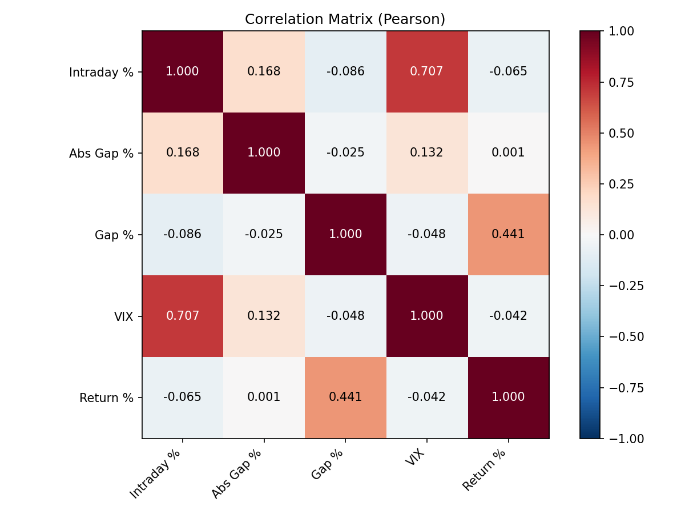
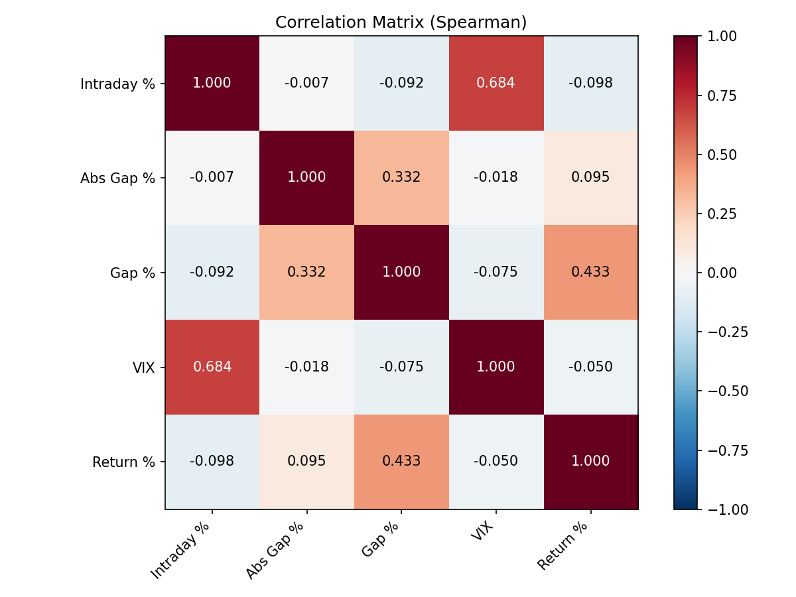
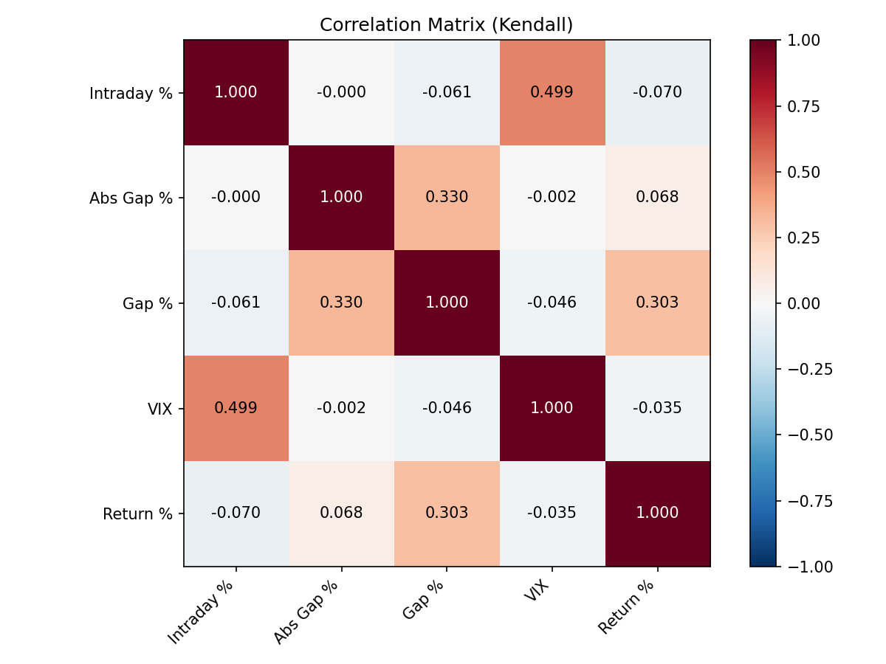

---

### 2. Rolling Correlations (60-day & 252-day windows)

Time-varying correlations to see if relationships are stable or regime-dependent.

| Pair | 252-day rolling range | Observation |
|------|----------------------|-------------|
| Intraday vs VIX | 0.30 - 0.85 | Consistently positive, but strength varies significantly |
| Intraday vs Abs Gap | -0.40 - 0.60 | Unstable -- swings between positive and negative |
| Abs Gap vs VIX | -0.30 - 0.55 | Mostly weak, occasionally spikes during crisis periods |

**Key finding**: The Intraday-VIX relationship is the only stable one. The 60-day window reveals short-term regime shifts where even this relationship temporarily weakens (e.g., post-COVID normalization).

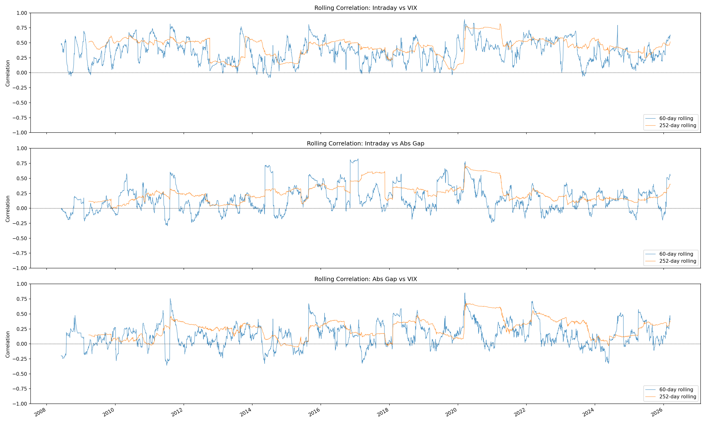

---

### 3. Lagged Cross-Correlations ( +/-20 days)

Tests whether one variable *leads* another.

| Pair | Best Lag | Correlation |
|------|----------|-------------|
| VIX -> Intraday Movement | -1 day | 0.710 |
| Intraday Movement -> VIX | +1 day | 0.710 |
| Abs Gap -> Intraday Movement | 0 days | 0.168 |
| VIX -> Abs Gap | -1 day | 0.136 |

**Key finding**: VIX and intraday movement are most correlated at lag +/-1 (r=0.71, slightly higher than lag-0 r=0.707). Yesterday's VIX is a marginally better predictor of today's intraday movement than today's VIX itself. The relationship is symmetric -- high intraday movement also predicts tomorrow's VIX staying elevated.

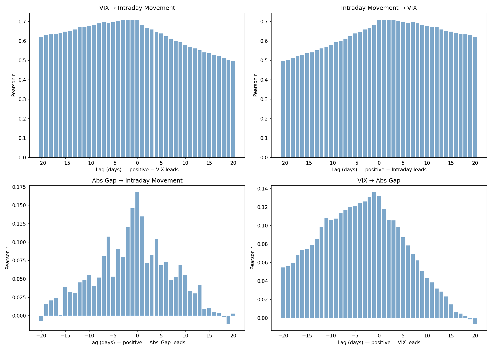

---

### 4. Mutual Information (Non-linear Dependencies)

Captures *any* statistical dependency, not just linear/monotonic. Values normalized to [0, 1].

| Pair | Normalized MI |
|------|--------------|
| **Intraday vs VIX** | **0.159** |
| Abs Gap vs Gap (signed) | 0.299 |
| Intraday vs Return | 0.077 |
| VIX vs Return | 0.065 |
| Intraday vs Abs Gap | 0.021 |

**Key finding**: The VIX-Intraday MI (0.159) confirms significant non-linear dependency beyond what Pearson captures. Intraday vs Abs Gap MI is very low (0.021), meaning there's genuinely no relationship, not just a non-linear one hiding from Pearson.

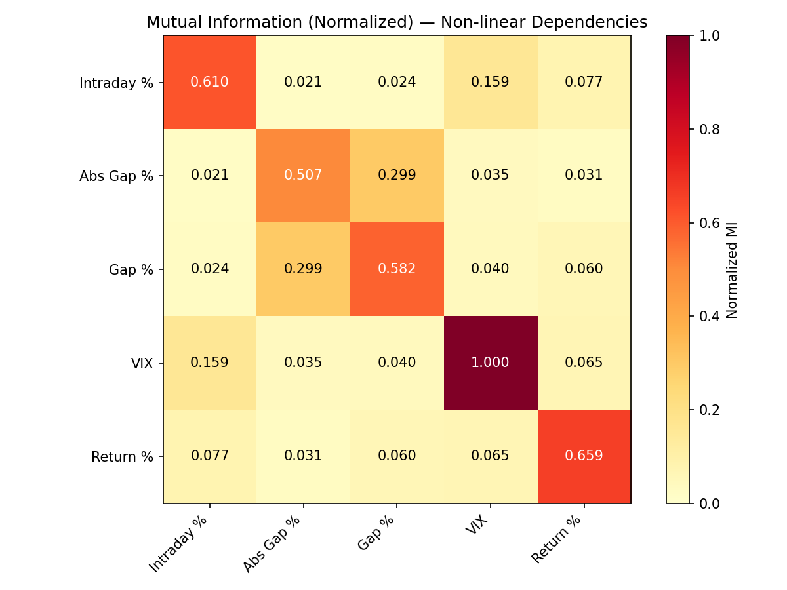

---

### 5. Regime-Based Analysis (VIX Regimes)

Correlations computed separately for different VIX environments:

| VIX Regime | N days | Intraday vs VIX (p) | Intraday vs Abs Gap (p) | Abs Gap vs VIX (p) |
|------------|--------|---------------------|------------------------|-------------------|
| Low VIX (< 17.1) | 2,196 | 0.382 | 0.087 | 0.104 |
| High VIX (>= 17.1) | 2,205 | 0.633 | -0.120 | -0.196 |
| Very High VIX (>= 22.1) | 1,102 | 0.605 | -0.165 | -0.276 |

**Key finding**: The Intraday-VIX correlation nearly *doubles* in high-VIX regimes (0.38 -> 0.63). The Abs Gap vs VIX correlation *flips negative* in high-VIX environments -- during crises, high VIX means large intraday swings, not necessarily large gaps.

Median intraday movement by VIX bucket:
- VIX < 12: ~1.1%
- VIX 12-16: ~1.5%
- VIX 16-20: ~1.9%
- VIX 20-30: ~2.6%
- VIX > 30: ~4.2%

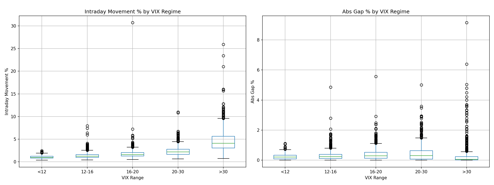

---

### 6. Scatter Plots with Linear Regression

| Pair | r | Slope | Interpretation |
|------|---|-------|----------------|
| VIX vs Intraday % | 0.707 | 0.124 | Each 1-point VIX increase -> ~0.12% more intraday movement |
| VIX vs Abs Gap % | 0.132 | 0.007 | Weak: VIX barely predicts gap size |
| Abs Gap vs Intraday % | 0.168 | 0.563 | Weak but positive -- large gaps tend to come with volatile days |

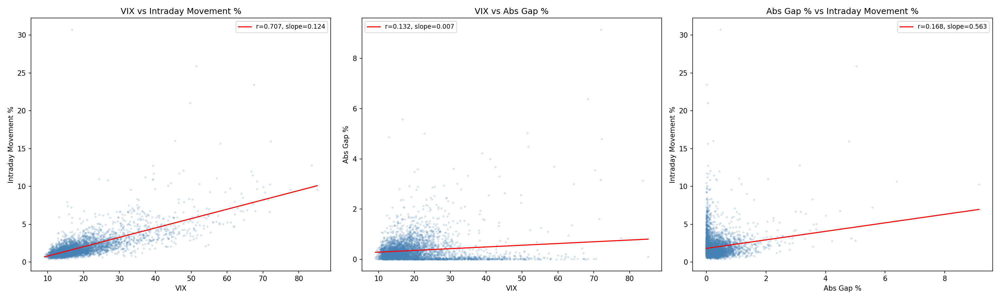

---

## Correlation Summary

1. **VIX is a strong predictor of intraday movement** (r=0.71). This is the dominant relationship in the dataset.
2. **Gaps are largely independent** of both VIX and intraday movement. They contain distinct information.
3. **The VIX-Intraday relationship is non-stationary** -- it's stronger during high-volatility regimes and weaker during calm markets.
4. **No meaningful lead-lag** exists between variables beyond 1 day. VIX at lag-1 is marginally better than contemporaneous VIX for predicting intraday movement.
5. **Negative gaps weakly predict larger intraday movement** (r=-0.086 for signed gap vs intraday), meaning gap-down days tend to be slightly more volatile intraday.
6. **Mutual information confirms** the VIX-Intraday link is the only meaningful non-linear dependency; gaps are genuinely independent.

---

## Breakout Continuation Analysis

When NIFTY closes above the previous day's high (bullish breakout) or below the previous day's low (bearish breakout), does the move continue? For how long?

### Frequency

| Type | Count | % of Trading Days |
|------|-------|-------------------|
| Bullish breakout (Close > Prev High) | 1,446 | 31.9% |
| Bearish breakout (Close < Prev Low) | 1,190 | 26.2% |
| Neither (Close within prev range) | ~42% | -- |

About 58% of trading days close outside the previous day's range -- breakouts are common, not exceptional.

### Continuation Streaks

How many consecutive days does the move continue (each day closing higher/lower than the prior)?

| Streak | Bullish | Bearish |
|--------|---------|---------|
| 0 (reverses next day) | 42.7% | 48.3% |
| 1 day | 25.0% | 24.5% |
| 2 days | 14.4% | 12.6% |
| 3 days | 7.5% | 7.0% |
| 4+ days | 10.5% | 7.7% |
| **Mean streak** | **1.3 days** | **1.1 days** |
| **Max streak** | **12 days** | **7 days** |

Roughly half of all breakouts reverse the very next day. Bullish breakouts have a slight continuation edge over bearish ones (57.3% vs 51.7% next-day win rate), and longer max streaks (12 vs 7 days).

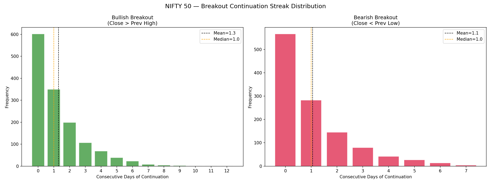

### Forward Returns After Breakouts

Average returns over fixed forward periods following a breakout day:

**After Bullish Breakout:**

| Period | Mean Return | Median Return | Win Rate (% higher) |
|--------|------------|---------------|---------------------|
| 1 day | +0.117% | +0.114% | 57.3% |
| 2 days | +0.154% | +0.193% | 57.7% |
| 3 days | +0.209% | +0.316% | 57.5% |
| 5 days | +0.248% | +0.389% | 58.1% |
| 10 days | +0.510% | +0.694% | 59.1% |
| 20 days | +1.034% | +1.229% | 61.2% |

**After Bearish Breakout:**

| Period | Mean Return | Median Return | Win Rate (% lower) |
|--------|------------|---------------|---------------------|
| 1 day | -0.021% | -0.045% | 51.7% |
| 2 days | +0.028% | +0.030% | 49.4% |
| 3 days | +0.065% | +0.046% | 48.7% |
| 5 days | +0.201% | +0.242% | 46.1% |
| 10 days | +0.403% | +0.510% | 43.8% |
| 20 days | +0.608% | +0.985% | 39.4% |

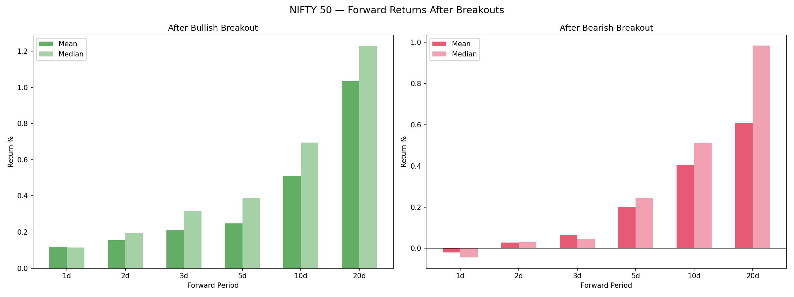
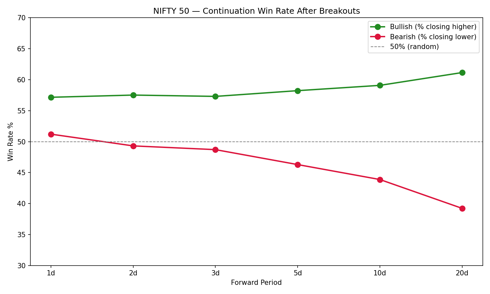

### Continuation Return by Streak Length

When a breakout does continue, how much return does each additional streak day add?

- Bullish: each additional day of streak adds roughly +0.5-0.7% cumulative return
- Bearish: each additional day adds roughly -1.0% cumulative return (but sample sizes get small beyond 5 days)

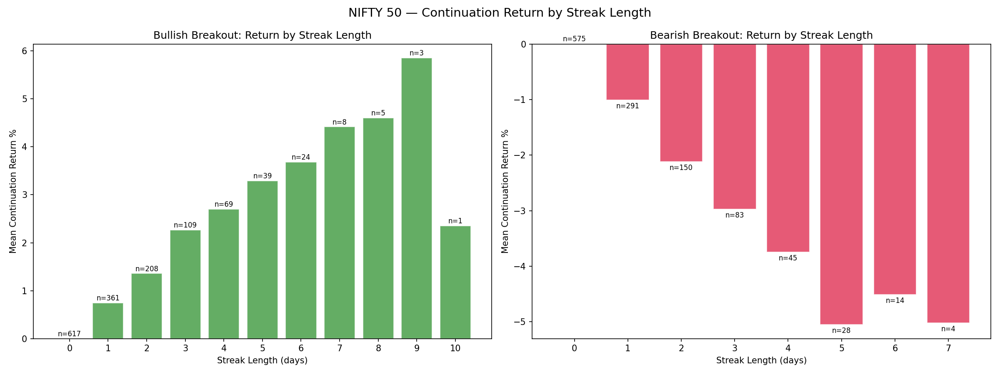

### Breakout Velocity and Magnitude

How far does the move go before consolidation/mean reversion, and how fast?

- **Breakout day magnitude**: how far beyond the previous day's high/low the close lands
- **Peak excursion**: the maximum favorable intraday move (using highs/lows) before 2 consecutive closes back past the breakout level
- **Days to peak**: trading days from breakout to peak excursion
- **Velocity**: peak excursion / days to peak (% per day)

| Metric | Bullish (median) | Bearish (median) |
|--------|-----------------|-----------------|
| Breakout day magnitude | 0.480% | 0.544% |
| Peak excursion | 1.364% | 1.306% |
| Days to peak | 3.0 | 2.0 |
| Velocity (% per day) | 0.311% | 0.460% |

**Key finding**: Bearish breakouts are *faster* -- they reach their peak excursion in 2 days (median) vs 3 for bullish, with 48% higher velocity (0.46%/day vs 0.31%/day). But both reach a similar peak magnitude (~1.3%). Bears move faster and exhaust sooner; bulls grind slower but persist longer.

The velocity by streak chart shows this clearly: as streaks extend, bullish peak excursion grows steadily while velocity stays flat (~0.3-0.5%/day). Bearish streaks maintain higher velocity (~1.0-1.5%/day) but cap out at 7 days.

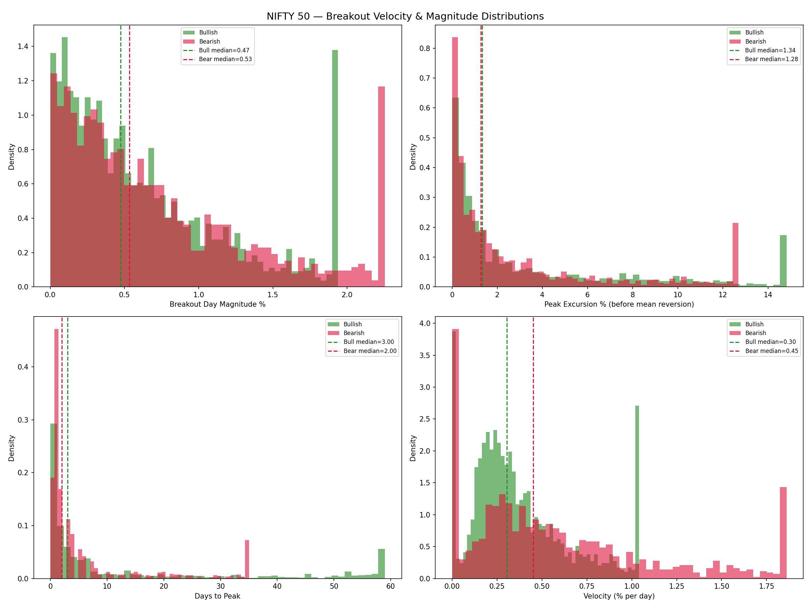
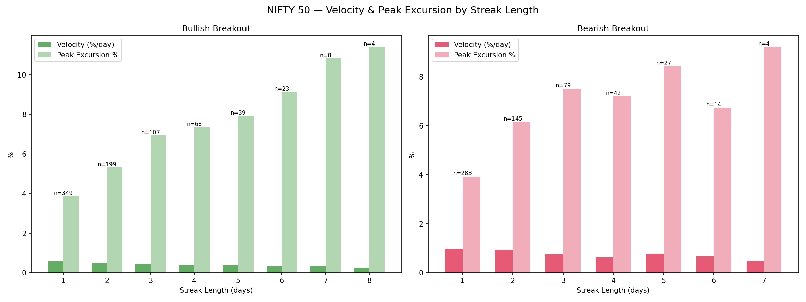

### Does Breakout Size Predict Continuation?

Breakout magnitude (how far beyond the prev high/low) is binned into quintiles to test if larger initial breakouts lead to longer streaks or bigger peak excursions.

| Observation | Bullish | Bearish |
|-------------|---------|---------|
| Magnitude vs Peak Excursion (r) | 0.173 | 0.177 |
| Magnitude vs Streak Length | Slight positive trend across quintiles | Flat / no trend |

**Key finding**: Initial breakout size is a *weak* predictor of how far the move goes (r~0.17 for both). Larger breakouts do tend to have slightly larger peak excursions, but the relationship is noisy. Breakout size does not meaningfully predict streak duration -- a small breakout can run for days, and a large one can reverse immediately.

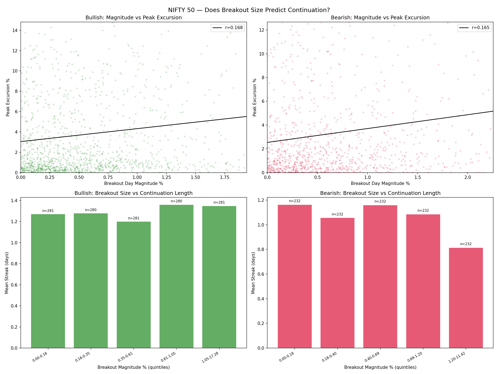

### Recovery After Bearish Breakdowns

After a bearish breakdown (close < prev low), how long until the market closes back at or above the breakdown-day close?

**98% of breakdowns recover within 252 trading days (1 year).**

| Metric | Value |
|--------|-------|
| Recovered within 1 year | 98.0% (1,166 of 1,190) |
| Median recovery time | **2 days** |
| Mean recovery time | 10.2 days |
| P75 | 5 days |
| P90 | 22 days |

Recovery time distribution:

| Window | % of all breakdowns |
|--------|-------------------|
| Next day (1d) | 48.2% |
| 2 days | 12.5% |
| 3-5 days | 13.8% |
| 6-10 days | 8.2% |
| 11-20 days | 5.0% |
| 21-60 days | 6.1% |
| 61-252 days | 4.1% |
| Never (within 1 year) | 2.0% |

**Key finding**: Nearly half of all bearish breakdowns recover the very next day. 75% recover within 5 days. Only 2% fail to recover within a year -- these correspond to major crashes (2008 GFC, COVID 2020 crash).

**Recovery by streak length**: Longer bearish streaks take significantly longer to recover. Streak-0 breakdowns (immediate reversal) recover in 1 day median. Streak-4+ breakdowns take 14-22 days median and have a 7-13% chance of not recovering within a year.

**Breakdown size doesn't predict recovery time** (r=-0.012). A large single-day breakdown recovers just as fast as a small one. What matters is whether it *continues* falling (streak length), not how far it fell on day 1.

**Max adverse move**: Before recovering, the median further drop is only 0.81%. Even in breakdowns, the typical "pain" beyond the breakdown day is less than 1%.

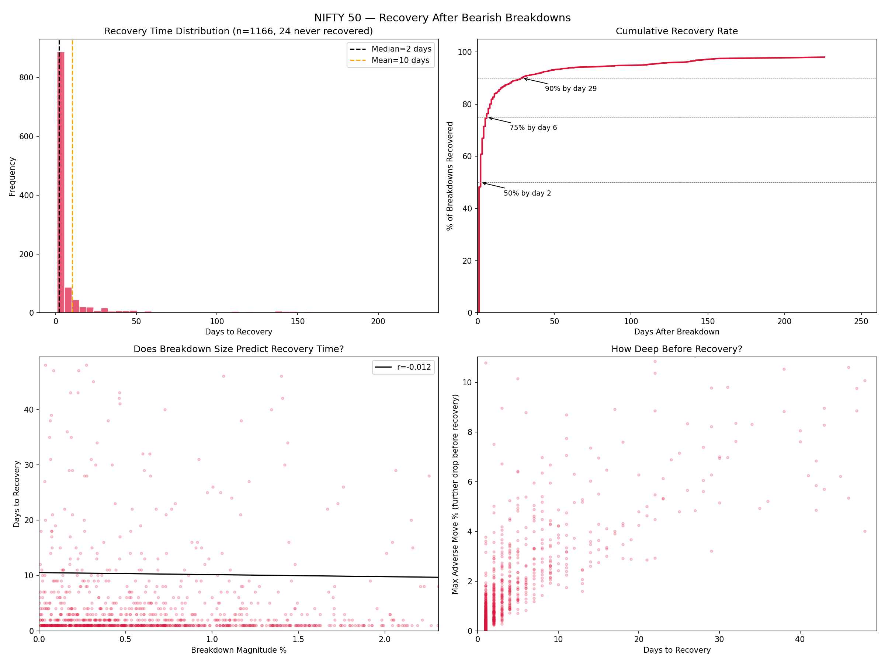
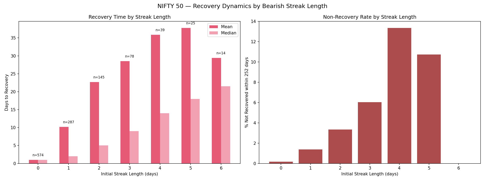

### VIX and Breakout Dynamics

How does India VIX relate to breakouts/breakdowns on the same day and in the following days?

**VIX levels by day type:**

| Day Type | Mean VIX | Median VIX | N |
|----------|----------|------------|---|
| Normal (no breakout) | 19.90 | 17.13 | 1,838 |
| Bullish Breakout | 19.01 | 16.49 | 1,403 |
| Bearish Breakdown | 20.71 | 17.75 | 1,160 |

Bearish breakdowns happen on slightly higher-VIX days and bullish breakouts on slightly lower-VIX days, as expected.

**Does VIX predict which breakouts continue vs reverse?**

| Type | Continued (VIX mean) | Reversed (VIX mean) | T-test p |
|------|---------------------|--------------------|----|
| Bullish | 18.78 | 19.32 | 0.24 (not significant) |
| Bearish | 20.14 | 21.30 | 0.04 (significant) |

For bullish breakouts, VIX doesn't distinguish continuations from reversals. For bearish breakdowns, the ones that *reverse* (mean-revert) actually have slightly *higher* VIX -- counter-intuitive, but likely reflects that extreme fear (high VIX) overshoots and snaps back.

**VIX trajectory after breakouts (mean change from breakout day):**

| Days After | Bullish VIX Change | Bearish VIX Change |
|-----------|-------------------|-------------------|
| Day 1 | +0.09 | -0.07 |
| Day 2 | +0.18 | -0.05 |
| Day 3 | +0.19 | -0.02 |
| Day 5 | +0.25 | -0.07 |
| Day 10 | +0.23 | -0.09 |

After bullish breakouts, VIX drifts slightly *up* (more uncertainty about whether the rally continues). After bearish breakdowns, VIX drifts *down* (fear subsides as the market recovers). Both effects are small (<0.5 VIX points).

**VIX correlations with breakout metrics (Spearman):**

| Pair | Bullish | Bearish |
|------|---------|---------|
| VIX vs Streak | -0.037 | -0.062 |
| VIX vs Peak Excursion | 0.139 | 0.154 |
| VIX vs Velocity | 0.345 | 0.302 |
| VIX vs Breakout Magnitude | 0.327 | 0.409 |
| VIX vs Recovery Time (bearish) | -- | -0.060 |

**Key findings**:
- **VIX does not predict streak length** (r ~ -0.04 to -0.06). High VIX doesn't mean a breakout will continue longer.
- **VIX strongly predicts velocity** (r=0.35 bull, 0.30 bear). In high-VIX environments, breakout moves are *faster* -- bigger % per day -- but not necessarily longer.
- **VIX predicts breakout magnitude** (r=0.33 bull, 0.41 bear). High-VIX breakouts punch harder through the prev high/low.
- **VIX does not predict bearish recovery time** (r=-0.06). A breakdown during high VIX recovers just as fast as during low VIX.

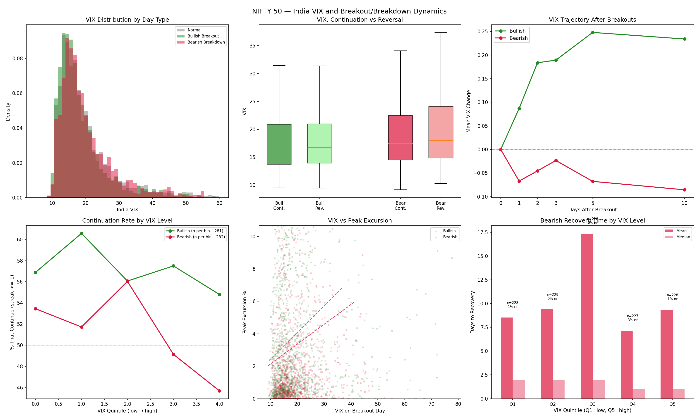

---

## Continuation Summary

1. **Bullish breakouts have genuine continuation**: 57% win rate at day 1, rising to 61% by day 20. The market's long-term upward drift (NIFTY ~5x over this period) provides a structural tailwind.

2. **Bearish breakouts are mean-reverting**: Only 52% continue on day 1, dropping to 39% by day 20. Closing below the previous low is actually a contrarian *buy* signal -- the market bounces back more often than it continues falling.

3. **The asymmetry is stark**: After a bullish breakout, you gain +1.03% over 20 days on average. After a bearish breakout, despite the breakdown, you still *gain* +0.61% over 20 days -- the bull bias overwhelms the breakdown signal.

4. **Streaks are short-lived**: Mean continuation is only 1.1-1.3 days. Most breakouts are noise, not the start of multi-day trends. The few that do extend (4+ days) deliver outsized returns but are rare (<11%).

5. **Bearish moves are more violent but shorter**: Max bearish streak is 7 days vs 12 for bullish. Bear moves exhaust themselves faster.

6. **Bearish breakouts are faster (higher velocity)**: 0.46%/day median velocity vs 0.31%/day for bullish. Bears reach peak excursion in 2 days (median) vs 3 for bulls. Same peak magnitude (~1.3%), but bears get there 50% faster.

7. **Breakout size is a poor predictor**: Initial magnitude only weakly predicts peak excursion (r~0.17) and barely predicts streak length. You can't tell from the breakout day alone whether it will continue.

8. **Bearish breakdowns recover fast**: Median recovery is just 2 days. 48% recover the next day, 75% within 5 days. Only 2% fail to recover within a year (major crashes). The breakdown magnitude doesn't predict recovery time -- what matters is whether the streak continues.

9. **Longer bearish streaks are harder to recover from**: Streak-0 recovers in 1 day. Streak-4+ takes 14-22 days median with up to 13% non-recovery risk within a year.

10. **VIX predicts breakout velocity and magnitude, but not duration**: High-VIX breakouts punch harder and move faster (%/day), but don't last longer. VIX also doesn't predict bearish recovery time. VIX tells you *how violent* the move will be, not *how long* it will last.

---

## Breakout Strategy Backtest

Can the breakout/breakdown signals be traded profitably? Backtested two approaches over ~4,500 trading days (2007-2026), 1 lot per trade:

1. **Futures**: Go long on bullish breakout close, short on bearish breakdown close
2. **Options**: Buy ITM call (~0.6 delta) on bullish breakout, ITM put on bearish breakdown (Black-Scholes pricing using India VIX as IV, weekly expiry assumption)

NIFTY lot sizes changed over time: 50 (2007-2015), 75 (2015-2024), 25 (2024+).

### Strategy Design

- **Entry**: At the close on the breakout/breakdown day
- **Stop loss**: Fixed % from entry price, checked intraday against lows (long) / highs (short)
- **Trailing SL**: Once price makes a new high/low, ratchet SL to trail by a % from the peak/trough
- **Time exit**: Close at end of max holding period if neither SL nor target hit
- **No re-entry**: After exit, skip to the next trading day before looking for new signals

For options, SL/exit triggers are based on the underlying NIFTY price. Option P&L is computed by repricing via Black-Scholes at exit (accounting for time decay).

### Baseline Results

Baseline parameters: SL=1%, no trailing SL, max hold 5 days, no profit target.

| Strategy | Trades | Win Rate | Total P&L | Profit Factor | Max Drawdown |
|----------|--------|----------|-----------|---------------|--------------|
| Futures | 859 | 37.3% | Rs 13,97,971 | 1.44 | Rs -1,28,389 |
| Options (0.6 delta) | 859 | 32.7% | Rs 7,41,576 | 1.31 | Rs -1,16,687 |

The baseline is profitable but has low win rate -- the tight 1% SL gets clipped by intraday noise frequently, but the winners run enough to overcome.

### Optuna-Optimized Parameters

Used [Optuna](https://optuna.org/) (300 trials) to optimize SL, trailing SL, holding period, profit target, and option delta. Objective: maximize Calmar ratio (P&L / max drawdown) weighted by square root of win rate.

| Parameter | Futures | Options |
|-----------|---------|---------|
| Stop Loss % | 2.0% | 2.1% |
| Trailing SL | Yes (0.3%) | Yes (0.3%) |
| Max Hold Days | 20 | 7 |
| Profit Target | None | None |
| Option Delta | -- | 0.75 |

Key insights from optimization:
- **Wider initial SL** (2% vs 1%) avoids getting stopped out by noise
- **Tight trailing SL** (0.3%) locks in profits once the move is underway
- **No profit target** -- let the trailing SL do the work
- **Longer hold for futures** (20 days) vs shorter for options (7 days) -- theta decay makes long holds expensive for options
- **Higher delta** (0.75 vs 0.6) for options -- deeper ITM reduces theta drag

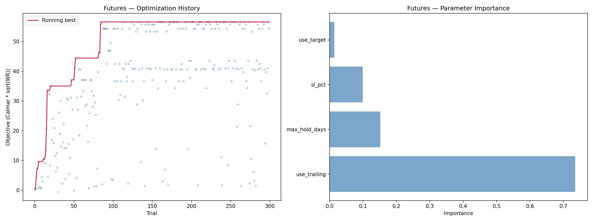
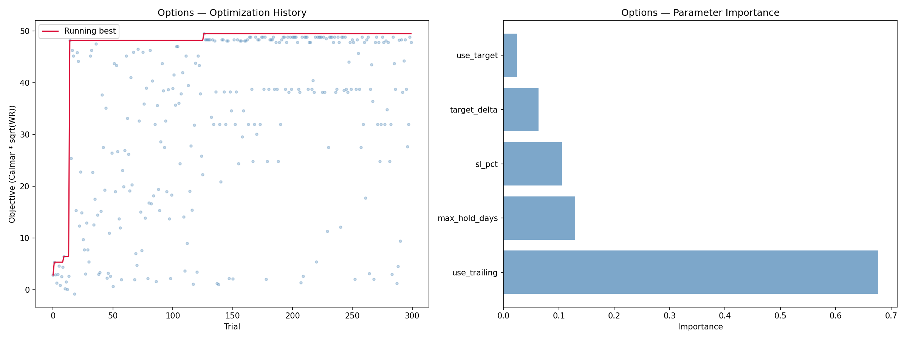

### Optimized Results

| Strategy | Trades | Win Rate | Total P&L | Profit Factor | Max Drawdown |
|----------|--------|----------|-----------|---------------|--------------|
| Futures Baseline | 859 | 37.3% | Rs 13,97,971 | 1.44 | Rs -1,28,389 |
| **Futures Optimized** | **1,099** | **72.0%** | **Rs 34,94,781** | **3.31** | **Rs -52,396** |
| Options Baseline | 859 | 32.7% | Rs 7,41,576 | 1.31 | Rs -1,16,687 |
| **Options Optimized** | **1,095** | **63.7%** | **Rs 25,39,672** | **3.06** | **Rs -40,958** |

Optimization improved every metric:
- **Win rate**: 37% -> 72% (futures), 33% -> 64% (options)
- **P&L**: 2.5x improvement for both strategies
- **Max drawdown**: Reduced by 60% (futures) and 65% (options)
- **Profit factor**: 1.44 -> 3.31 (futures), 1.31 -> 3.06 (options)

**By direction (optimized futures):**

| Direction | Trades | Total P&L | Avg P&L |
|-----------|--------|-----------|---------|
| Long | 594 | Rs 20,26,434 | Rs 3,412 |
| Short | 505 | Rs 14,68,346 | Rs 2,908 |

Both sides are profitable. Longs have a slight edge due to NIFTY's structural upward drift.

### Equity Curves

.png)
.png)

### Backtest Takeaways

1. **Breakout trading works on NIFTY** -- both futures and options strategies are profitable over 17 years of data, even with naive baseline parameters.

2. **The optimal approach is wide SL + tight trailing SL** -- give the trade room to breathe initially (2% SL), then lock in profits aggressively (0.3% trailing). This is the single most impactful finding from the optimization.

3. **No profit target outperforms fixed targets** -- letting winners run with a trailing SL captures more of the tail than capping at a fixed %. This aligns with the continuation analysis showing that the few 4+ day streaks deliver outsized returns.

4. **Options underperform futures** -- theta decay erodes ~27% of the P&L. The optimized delta moved to 0.75 (deeper ITM) to minimize this, and hold period shortened to 7 days. For this strategy, futures are the better instrument.

5. **Both long and short sides work** -- despite NIFTY's bull bias, shorting breakdowns is profitable. The wide SL + trailing SL catches the fast, violent bearish moves identified in the continuation analysis.

6. **Caveat: overfitting risk** -- Optuna optimized over the full dataset. Walk-forward or out-of-sample testing would be needed to validate these parameters for live trading. The 300-trial optimization with 5 parameters is relatively conservative, but the dramatic improvement (2.5x P&L) warrants skepticism.

---

## 5-Minute Data Backtest: EOD vs Intraday Entry

Using 5-minute candle data (2015-2026, [Kaggle source](https://www.kaggle.com/datasets/debashis74017/nifty-50-minute-data)), we test a key question: **should you enter at end of day (when the breakout is confirmed by close) or intraday (as soon as price breaches the previous day's high/low)?**

### Entry Modes

| Mode | Entry Trigger | Entry Price |
|------|--------------|-------------|
| **EOD** | Day closes above Prev Day High (bullish) or below Prev Day Low (bearish) | Day's close price |
| **Intraday** | First 5-min candle opens above PDH or below PDL | That candle's open price |

The intraday mode enters earlier but includes "false breakouts" -- days where price breaches PDH/PDL intraday but closes back within range. The EOD mode waits for confirmation but enters at a worse price (the move has already happened).

For intraday entry, stop-loss checking on the entry day uses only the post-entry portion of the day (candles after the entry candle), avoiding the look-ahead bias of using the full day's high/low.

### Signal Counts

Over ~2,700 usable trading days (2015-2026):

| Signal Type | Bullish | Bearish |
|-------------|---------|---------|
| EOD (close confirms) | 854 | 695 |
| Intraday (any 5-min breach) | 1,544 | 1,212 |

Intraday signals are ~1.8x more frequent than EOD signals. Many intraday breaches don't result in a confirmed close-based breakout.

### Optimized Parameters (5-min)

All 4 combinations independently optimized with Optuna (300 trials each):

| Parameter | Fut EOD | Fut Intraday | Opt EOD | Opt Intraday |
|-----------|---------|-------------|---------|-------------|
| Stop Loss % | 1.9% | 2.3% | 1.9% | 2.4% |
| Trailing SL | Yes (0.3%) | Yes (0.3%) | Yes (0.3%) | Yes (0.3%) |
| Max Hold Days | 19 | 19 | 7 | 4 |
| Profit Target | None | None | None | None |
| Option Delta | -- | -- | 0.75 | 0.75 |

Key pattern: **intraday entry needs a wider initial SL** (2.3-2.4% vs 1.9%) because the entry happens earlier in the move -- before the breakout is confirmed -- so there's more noise to absorb. The trailing SL (0.3%) is identical across all modes.

Options intraday uses a shorter hold (4 days vs 7 for EOD) -- entering earlier means the favorable move happens sooner, and theta decay is minimized.

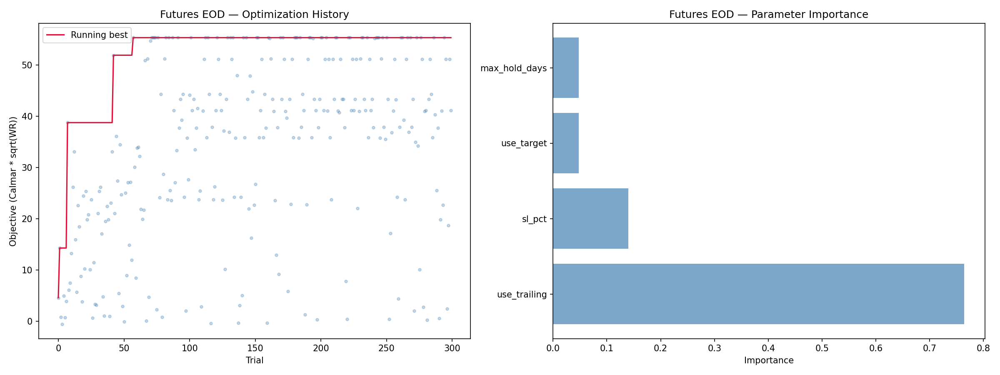
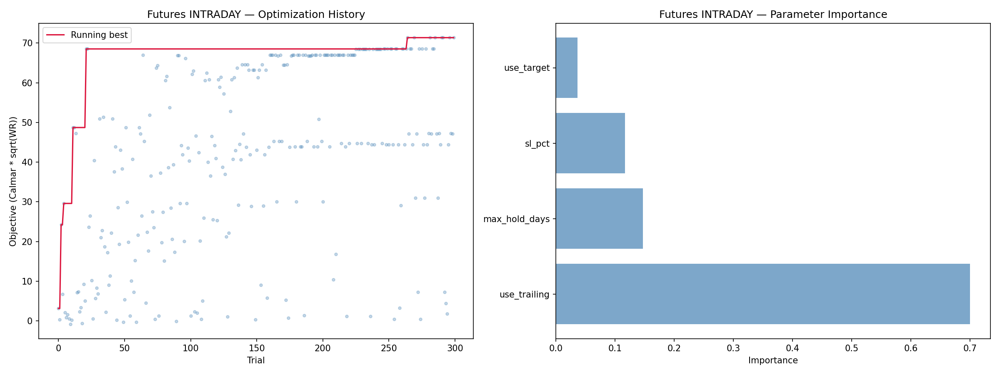
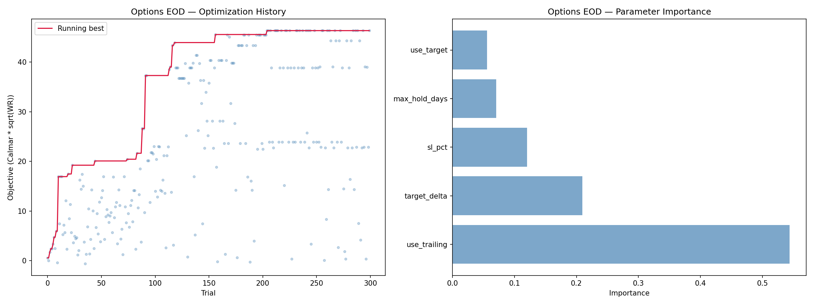
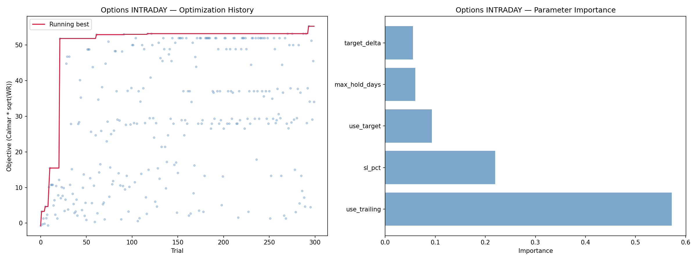

### Full Comparison (5-min)

| Strategy | Trades | Win Rate | Total P&L | Profit Factor | Max Drawdown |
|----------|--------|----------|-----------|---------------|--------------|
| Futures EOD Baseline | 512 | 42.4% | Rs 12,11,263 | 1.47 | Rs -1,24,868 |
| **Futures EOD Optimized** | **674** | **72.6%** | **Rs 31,14,724** | **4.10** | **Rs -47,959** |
| Futures Intraday Baseline | 628 | 40.4% | Rs 11,54,170 | 1.35 | Rs -1,77,024 |
| **Futures Intraday Optimized** | **1,121** | **60.8%** | **Rs 37,96,516** | **4.05** | **Rs -41,502** |
| Options EOD Baseline | 512 | 36.1% | Rs 6,40,920 | 1.33 | Rs -1,17,973 |
| **Options EOD Optimized** | **674** | **60.8%** | **Rs 21,50,291** | **3.35** | **Rs -36,195** |
| Options Intraday Baseline | 628 | 35.2% | Rs 7,49,700 | 1.33 | Rs -1,42,356 |
| **Options Intraday Optimized** | **1,124** | **55.7%** | **Rs 27,97,343** | **3.63** | **Rs -37,750** |

### EOD vs Intraday Equity Curves

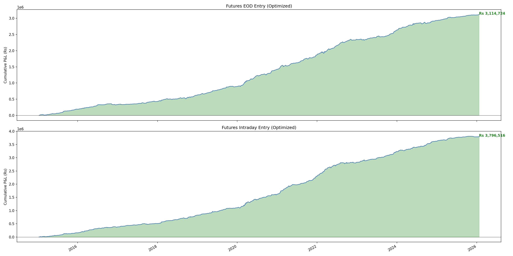
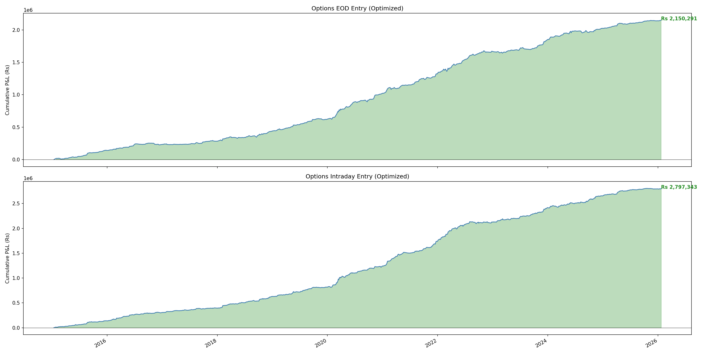
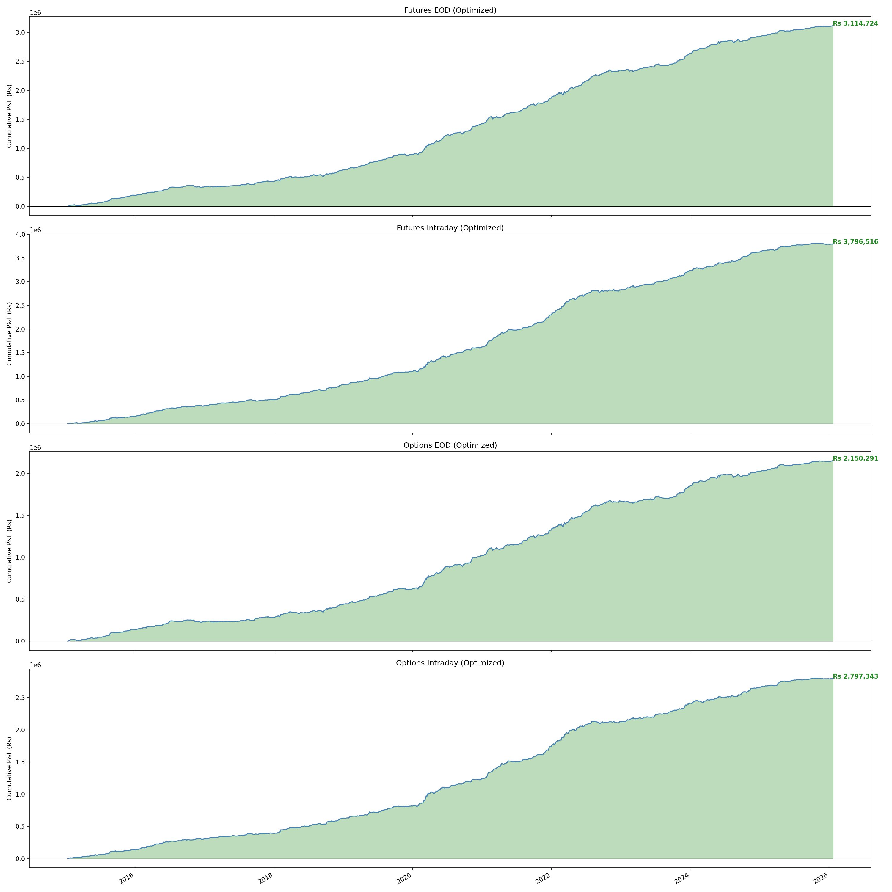

### EOD vs Intraday Takeaways

1. **Intraday entry generates 22% more P&L for futures** (Rs 37.9L vs Rs 31.1L) and **30% more for options** (Rs 28.0L vs Rs 21.5L). Entering earlier captures more of the move.

2. **Intraday entry trades ~1.7x more frequently** (1,121 vs 674 futures trades). It catches breakouts that reverse before EOD -- some of these still make money before the SL is hit or trailing SL locks in a profit.

3. **EOD entry has higher win rate** (72.6% vs 60.8% for futures). Waiting for close confirmation filters out false breakouts, so a larger fraction of trades succeed. But the additional trades from intraday entry are profitable enough on average to boost total P&L.

4. **Intraday entry needs a wider initial SL** (2.3% vs 1.9% for futures). The entry happens before confirmation, so the position experiences more adverse excursion before the move develops. The extra 0.4% SL buffer is the price of entering early.

5. **Max drawdown is similar** -- Rs 41.5K (intraday) vs Rs 48.0K (EOD) for futures. The intraday mode's diversification across more trades actually reduces drawdown slightly.

6. **The trailing SL (0.3%) is the universal constant** -- every single optimization landed on 0.3% trailing. This appears to be a structural property of NIFTY breakout dynamics, not an artifact of overfitting.

7. **Options intraday is the strongest risk-adjusted strategy** -- profit factor of 3.63 with a max drawdown of just Rs 37.7K. Entering early on the option captures the delta move while the short hold (4 days) minimizes theta decay.

8. **Bottom line**: If you can monitor intraday, entering on the first 5-min breach of PDH/PDL with a 2.3% SL and 0.3% trailing SL is more profitable than waiting for EOD confirmation. The trade-off is lower win rate and more screen time.
